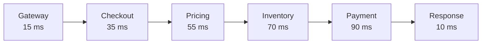
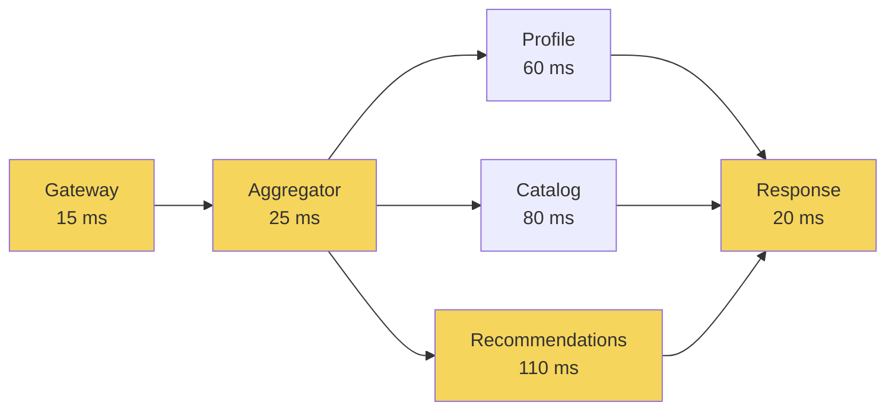

# Latency Budget Analyzer

Which dependency actually determines your API latency?

```
Input:
YAML service graph + target latency + service latency values

Output:
critical path
remaining budget
slack
parallelization opportunities
highest latency-budget risk
```

```
SEQUENTIAL LATENCIES ADD

PARALLEL LATENCIES TAKE THE SLOWEST BRANCH

OPTIMIZING OFF THE CRITICAL PATH
MAY SAVE 0 MS END-TO-END
```

```
SUM OF SERVICE P95s
!=
TRUE END-TO-END P95
```

This tool performs **deterministic latency-budget analysis** using the
supplied values as planning inputs (allocated budgets, observed
representative p95s, or other chosen numbers). It does **not** predict
production p95.

## How the analyzer sees a service graph

Sequential dependencies add to the critical path.

Parallel branches execute concurrently, so the slowest required branch
determines when the join can continue.

### Sequential path

`examples/sequential.yaml` — every service waits for the previous one.
Critical-path budget estimate: **275 ms** (15 + 35 + 55 + 70 + 90 + 10).



### Parallel branches

`examples/parallel.yaml` — profile, catalog, and recommendations start
together after aggregator. Highlighted nodes are the selected critical
path: **170 ms** (15 + 25 + 110 + 20), not 310 ms.



## Quick start

```bash
python3.12 -m venv .venv
source .venv/bin/activate
pip install -e ".[dev]"

latency-budget-analyzer analyze examples/parallel.yaml
python -m latency_budget_analyzer analyze examples/sequential.yaml

make test
```

## Example (parallel)

`examples/parallel.yaml` — gateway 15 + aggregator 25, then profile 60 /
catalog 80 / recommendations 110 in parallel, then response 20.

Critical path: `gateway → aggregator → recommendations → response`

Critical-path budget estimate: **170 ms** (not 310 ms). Remaining vs
250 ms target: **80 ms**. Status: `WITHIN_BUDGET`.

Reducing profile 60 → 30 saves **0 ms** end-to-end. Recommendations still
dominate.

## Exit codes

| Code | Meaning |
|---:|---|
| 0 | valid graph, within or at budget |
| 1 | valid graph, budget exceeded |
| 2 | invalid input / schema / cycle |

`--format json` writes stable structured output for CI.

## Limitations

Deterministic architecture-budget analyzer. Not an APM, tracer, or
production p95 predictor. See [docs/LIMITATIONS.md](docs/LIMITATIONS.md).
