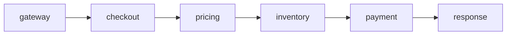
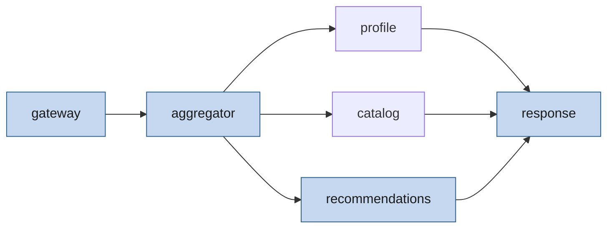

# Example graphs

## Sequential (`examples/sequential.yaml`)

Critical path is the entire chain (275 ms).

## Parallel (`examples/parallel.yaml`)

Critical path highlighted: gateway → aggregator → recommendations → response (170 ms).

